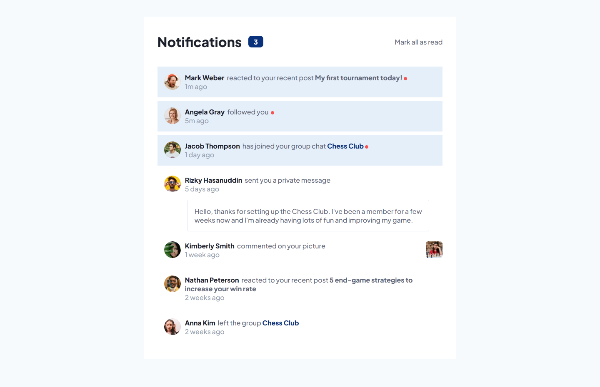
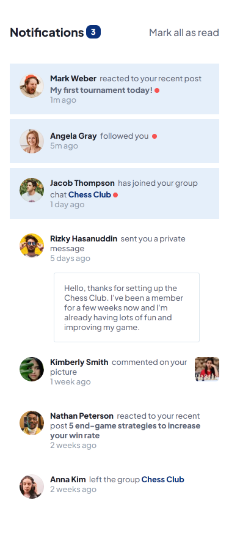

# Notifications-Page

Frontend Mentor - Notifications page solution

This is a solution to the [Notifications page challenge on Frontend Mentor](https://www.frontendmentor.io/challenges/notifications-page-DqK5QAmKbC). Frontend Mentor challenges help you improve your coding skills by building realistic projects.

## Table of contents

-   [Notifications-Page](#notifications-page)
    -   [Table of contents](#table-of-contents)
    -   [Overview](#overview)
        -   [The challenge](#the-challenge)
        -   [Screenshot](#screenshot)
        -   [Links](#links)
    -   [My process](#my-process)
        -   [Built with](#built-with)
    -   [Author](#author)

**Note: Delete this note and update the table of contents based on what sections you keep.**

## Overview

### The challenge

Users should be able to:

-   Distinguish between "unread" and "read" notifications
-   Select "Mark all as read" to toggle the visual state of the unread notifications and set the number of unread messages to zero
-   View the optimal layout for the interface depending on their device's screen size
-   See hover and focus states for all interactive elements on the page

### Screenshot

-   Desktop View
    

-   Mobile View
-   

### Links

-   Solution URL: [Code](https://github.com/ChinatuL/Notifications-Page)
-   Live Site URL: [Live Site](https://chinatul.github.io/Notifications-Page/)

## My process

### Built with

-   HTML
-   CSS
-   SASS
-   Vanilla JS

## Author

-   Frontend Mentor - [@ChinatuL](https://www.frontendmentor.io/profile/ChinatuL)
-   Twitter - [@ChinatuLucia](https://www.twitter.com/ChinatuLucia)
